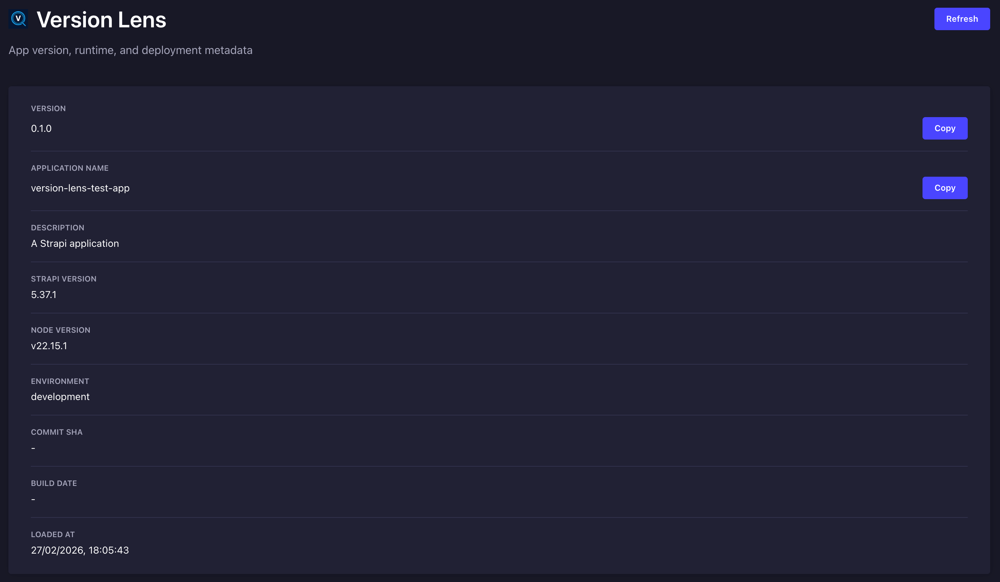

<p align="center">
  
</p>

<h1 align="center">Strapi v5 - Plugin Version Lens</h1>

<p align="center">
  Version Lens adds a dedicated admin settings page for app version, runtime, and deployment metadata.
</p>

<hr />

<p align="center">
  
</p>

<hr />

## Why Version Lens

- Clear release visibility inside Strapi admin
- Fast diagnostics for deployments and environment drift
- Copy-ready version and commit values
- Lightweight setup with optional env key customization

## Features

- Settings path: `Settings -> Global -> Version Lens`
- Authenticated admin API route: `GET /version-lens/info`
- Shows:
  - app name, version, description (from host app `package.json`)
  - Strapi version
  - Node.js version
  - runtime environment
  - commit SHA
  - build date
  - generated timestamp

## Installation

1. Install:

```bash
npm install strapi-plugin-version-lens
```

2. Enable plugin in your Strapi app `config/plugins.ts`:

```ts
export default () => ({
  'version-lens': {
    enabled: true,
    config: {
      commitShaEnvKeys: ['GIT_COMMIT_SHA', 'CI_COMMIT_SHA', 'VERCEL_GIT_COMMIT_SHA'],
      buildDateEnvKeys: ['BUILD_DATE', 'CI_BUILD_DATE', 'VERCEL_BUILD_DATE'],
    },
  },
});
```

3. Restart Strapi.

## Local Testing (Before Publish)

```bash
npm pack
npm install /path/to/strapi-plugin-version-lens-1.0.0.tgz
```

## Configuration

You can control env resolution order:

- `commitShaEnvKeys`: list of env keys checked for commit SHA
- `buildDateEnvKeys`: list of env keys checked for build date

Default supported keys:

- Commit SHA: `GIT_COMMIT_SHA`, `CI_COMMIT_SHA`, `VERCEL_GIT_COMMIT_SHA`
- Build date: `BUILD_DATE`, `CI_BUILD_DATE`, `VERCEL_BUILD_DATE`

Legacy config keys are still supported as fallback:

- `release-radar`
- `version-settings`

## API Response Example

```json
{
  "version": "1.2.3",
  "name": "my-strapi-app",
  "description": "My project",
  "strapiVersion": "5.x.x",
  "nodeVersion": "v22.x.x",
  "environment": "production",
  "commitSha": "a1b2c3d",
  "buildDate": "2026-02-27T12:00:00.000Z",
  "generatedAt": "2026-02-27T12:15:00.000Z"
}
```

## Development and CI

- Run tests: `npm test`
- Validate package contents: `npm run pack:check`
- Build plugin: `npm run build`

## Project Links

- GitHub: [Ali-Shaikh/strapi-plugin-version-lens](https://github.com/Ali-Shaikh/strapi-plugin-version-lens)
- Issues: [Report issues](https://github.com/Ali-Shaikh/strapi-plugin-version-lens/issues)
